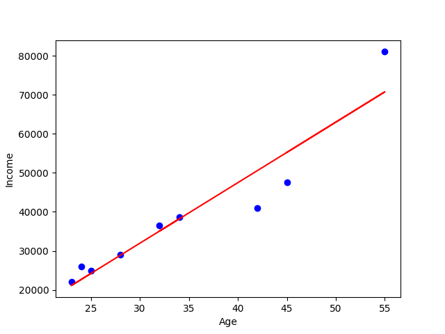

# Age and Income Linear-Regression Analysis

This script performs a simple linear regression analysis on the relationship between age and income using data from the provided `Age_Income.csv` file.


## Requirements

Before running the script, make sure you have the following Python libraries installed:

- pandas
- numpy
- matplotlib

You can install these libraries using pip:

```bash
pip install pandas numpy matplotlib
```

## Data Description

The [Age_Income.csv](Age_Income.csv) file contains two columns: Age and Income. Each row represents a data point with the age and income of an individual.


Here is a sample of the data:

| Age | Income |
|-----|--------|
| 25  | 25000  |
| 23  | 22000  |
| 24  | 26000  |
| 28  | 29000  |
| 34  | 38600  |
| 32  | 36500  |
| 42  | 41000  |
| 55  | 81000  |
| 45  | 47500  |

## Usage

You can run the provided Python script `regression_analysis.py` to performs a simple linear regression analysis on the relationship between age and income using data from the provided `Age_Income.csv` file. Here's how to run it:

```bash
python regression_analysis.py
```
## Script Explanation

The Python script `regression_analysis.py` contains the following code:

```python
import pandas as pd
import numpy as np
import matplotlib.pyplot as plt
# To read data from Age_Income.csv file
dataFrame = pd.read_csv('Age_Income.csv')
# To place data in to age and income vectors
age = dataFrame['Age']
income = dataFrame['Income']
# number of points
num = np.size(age)
# To find the mean of age and income vector
mean_age = np.mean(age)
mean_income = np.mean(income)
# calculating cross-deviation and deviation about age
CD_ageincome = np.sum(income*age) - num*mean_income*mean_age
CD_ageage = np.sum(age*age) - num*mean_age*mean_age
# calculating regression coefficients
b1 = CD_ageincome / CD_ageage
b0 = mean_income - b1*mean_age
# to display coefficients
print("Estimated Coefficients :")
print("b0 = ",b0,"\nb1 = ",b1)
# To plot the actual points as scatter plot
plt.scatter(age, income, color = "b",marker = "o")
# TO predict response vector
response_Vec = b0 + b1*age
# To plot the regression line
plt.plot(age, response_Vec, color = "r")
# Placing labels
plt.xlabel('Age')
plt.ylabel('Income')
# To display plot
plt.show()
```

1. The script uses pandas to read the data from the `Age_Income.csv` file into a DataFrame.
2. It extracts the Age and Income columns from the DataFrame into separate arrays.
3. It calculates the mean of the Age and Income vectors.
4. The script then calculates the regression coefficients using simple linear regression formulas.
5. After computing the regression coefficients, it prints them.
6. Next, it plots the actual data points as a scatter plot and the regression line.
7. Finally, it displays the plot.

## Running the Script

Before running the script, make sure you have installed the necessary Python libraries: pandas, numpy, and matplotlib.

You can run the script using any Python environment or IDE.

```bash
python regression_analysis.py
```
## Expected Output

Upon running the script, you should see a scatter plot with the actual data points and a regression line fitted to the data.



